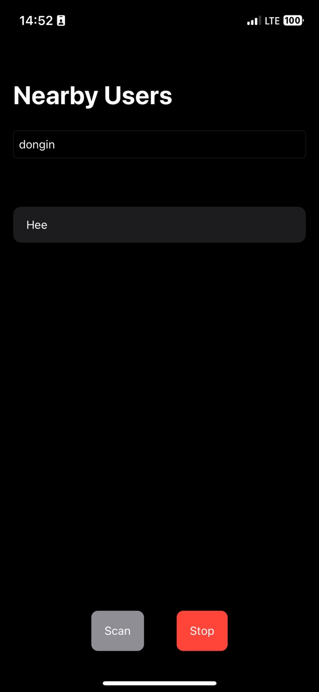

### 블루투스 스캐닝 테스트

 

CoreBluetooth를 활용하여, 중심모드와 주변모드 기능을 통해, 타기기에서 송출하는 특정 값이 수신되는지, 송출되는지 확인하는 테스트 프로젝트입니다.
같은 service uuid(해당 테스트 어플)를 사용하는 유저끼리 서로를 특정하는데 성공했습니다.
주변에서 송출하는 정보를 수신해 리스트로 담을 수 있습니다.

 

